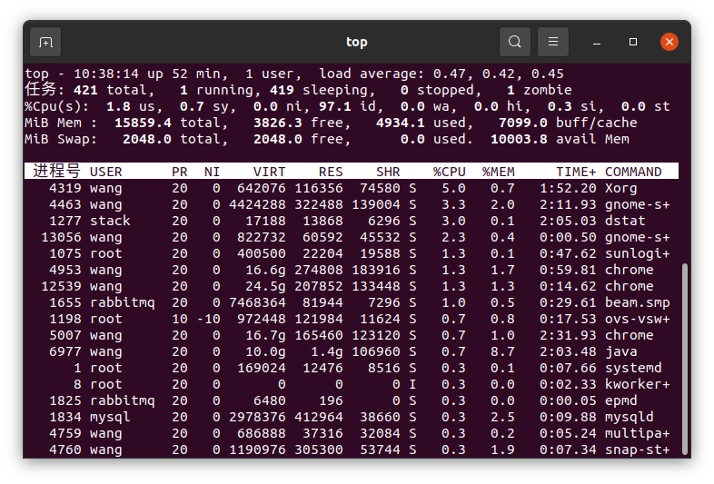

## 操作系统基础

### 1. 操作系统的基本特点

**并发：**是在计算机系统中**同时存在多个程序**，宏观上看，这些程序是同时向前推进的。 在单CPU上，这些并发执行的程序是交替在CPU上运行的。程序并发性体现在两个方面： 用户程序与用户程序之间的并发执行。 用户程序与操作系统程序之间的并发。

**共享：**资源共享是操作系统程序和**多个用户程序共用系统中的资源**。

**虚拟：**是指通过技术**将一个物理实体变成若干个逻辑上的对应物**。在操作系统中虚拟的实现主要是通过分时的使用方法。显然，如果n是某一个物理设备所对应的虚拟逻辑设备数，则虚拟设备的速度必然是物理设备速度的1/n。

**异步（不确定性）：**同一程序和数据的**多次运行可能得到不同的结果**；程序的运行时间、运行顺序也具有不确定性；外部输入的请求、运行故障发生的时间难以预测。这些都是不确定性的表现。

**随机性：**是指操作系统的运行是在一个随机的环境中，一个设备可能在任何时间向处理机发出中断请求，系统无法知道运行着的程序会在什么时候做什么事情。

### 2. 并行与并发的区别

一个人"同时"做多件事，就是并发；多个人"同时"做多件事，就是并行

**并发：**指在同一时刻只能有一条指令执行，但多个进程指令被快速的**轮换执行**，使得在宏观上具有多个进程同时执行的效果，但在微观上并不是同时执行的，只是把时间分成若干段，使多个进程快速交替的执行。所以并发编程的目标是充分的利用处理器的每一个核，以达到最高的处理性能。

**并行：**指在同一时刻，有多条指令在多个处理器上**同时执行**。所以无论从微观还是从宏观来看，二者都是一起执行的。

**并发与并行的区别：**

- 并发，指的是多个事情，在同一时间段内同时发生了；并行，指的是多个事情，在同一时间点上同时发生了。
- 并发的多个任务之间是互相抢占资源的；并行的多个任务之间是不互相抢占资源的。
- 只有在多CPU的情况中，才会发生并行；否则，看似同时发生的事情，其实都是并发执行的。

## 进程管理

### 1. 什么是进程

​	进程是**一个具有独立功能的程序关于某个数据集合的一次运行活动**。它可以申请和拥有系统资源，是一个动态的概念，是一个活动的实体。操作系统会以进程为单位，分配系统资源（CPU时间片、内存等资源），进程是**资源分配的最小单位**，且每个进程拥有独立的地址空间。

### 2. 什么是线程

​	线程是进程的⼀个实体，是进程的⼀条执⾏路径；⽐进程更⼩的独⽴运⾏的基本单位，线程也被称为**轻量级进程**，是操作系统调度（CPU调度）执行的最小单位。一个标准的线程由线程ID，当前指令指针PC，寄存器和堆栈组成。一个进程可以有一个或多个线程，各个线程之间共享程序的内存空间(也就是所在进程的内存空间)。

### 3. 进程与线程的区别

- 同⼀进程的线程**共享**本进程的系统资源（CPU时间片、内存等资源），⽽进程之间则是**独⽴**的系统资源
- 线程是 **CPU 调度**的最小单位，而进程是操作系统**分配资源**的最小单位
- **多进程⽐多线程健壮**：⼀个进程崩溃后，在保护模式下不会对其他进程产⽣影响，但是⼀个线程崩溃整个进程崩溃

- **多线程效率优于多进程**：进程切换，消耗的资源⼤，所以涉及到频繁的切换，使⽤线程要好于进程

- 每个独⽴的进程有⼀个程序的⼊⼝、程序出⼝。但是线程不能独⽴执⾏，必须依存在应⽤程序中，由应⽤程序提供多个线程执⾏控制。

**进程与线程联系的形象理解：**

​	进程和线程的关系类似于公路交通中的多向多车道公路，一个方向的公路视为一个**进程**，一个方向中多个车道线分割开的车道视为多个进程。一个方向的公路由一个或多个车道组成，他们共享道路资源，但不同方向的公路之间是相对独立的。这些不同方向和不同车道都可以**并发**运行，相同方向的不同车道间可以快捷协作同步，而不同方向中的不同车道则需要交通信号灯进行消息通行实现同步执行。

**进程与线程所占有的系统资源：**

线程 **私有**：线程栈，寄存器，程序寄存器 **共享**：堆，地址空间，全局变量，静态变量
进程 **私有**：地址空间，堆，全局变量，栈，寄存器 **共享**：代码段，公共数据，进程⽬录，进程ID

### 4. 线程的特点

- 线程在程序中是独⽴的、**并发的执⾏流**，但是进程中的线程之间的隔离程度要⼩；

- 线程⽐进程更具有**更⾼的性能**，这是由于同⼀个进程中的线程都有共性：多个线程将共享同⼀个进程虚拟空间；

- 当操作系统创建⼀个进程时，必须为进程分配独⽴的内存空间，并分配⼤量相关资源，而线程创建的**资源消耗要小**很多；

### 5. 多进程与多线程的区别

- **多进程⽐多线程健壮**：⼀个进程崩溃后，在保护模式下不会对其他进程产⽣影响，但是⼀个线程崩溃整个进程崩溃
- **多线程效率优于多进程**：进程切换，消耗的资源⼤，所以涉及到频繁的切换，使⽤线程要好于进程

**基于各自特点多进程和多线程有这不同的使用场景:**

1) 需要频繁创建销毁的优先⽤线程；
2) 需要进⾏⼤量计算的优先使⽤线程；
3) 强相关的处理⽤线程，弱相关的处理⽤进程；
4) 可能要扩展到多机分布的⽤进程，多核分布的⽤线程；

### 6. 什么是线程同步

​	线程同步是指多线程通过特定的设置来**控制**线程之间的**执⾏顺序**，也可以说在线程之间通过同步建⽴起执⾏顺序的关系；主要四种⽅式，**临界区、互斥对象、信号量、事件对象**；其中临界区和互斥对象主要⽤于**互斥控制**，信号量和事件对象主要⽤于**同步控制**。

### 7. 线程的同步方式

**互斥控制**

- 临界区：通过对多线程的串⾏化来访问公共资源或⼀段代码，速度快、适合控制数据访问。在**任意⼀个时刻只允许⼀个线程对共享资源进⾏访问**，如果有多个线程试图访问公共资源，那么在有⼀个线程进⼊后，其他试图访问公共资源的线程将被**挂起**，并⼀直等到进⼊临界区的线程离开，临界区在被释放后，其他线程才可以抢占。

- 互斥对象：互斥对象和临界区很像，采⽤互斥对象机制，只有拥有互斥对象的线程才有访问公共资源的权限。因为互斥对象只有⼀个，所以能保证公共资源不会同时被多个线程同时访问。当前拥有互斥对象的线程处理完任务后必须将线程交出，以便其他线程访问该资源。

**同步控制**

- 信号量：它允许多个线程在同⼀时刻访问同⼀资源，但是需要限制在同⼀时刻访问此资源的最⼤线程数⽬。在⽤ `CreateSemaphore()` 创建信号量时即要同时指出允许的最⼤资源计数和当前可⽤资源计数。⼀般是将当前可⽤资源计数设置为最⼤资源计数，每增加⼀个线程对共享资源的访问，当前可⽤资源计数就会减 1 ，只要当前可⽤资源计数是⼤于 0 的，就可以发出信号量信号。但是当前可⽤计数减⼩ 到0 时则说明当前占⽤资源的线程数已经达到了所允许的最⼤数⽬，不能在允许其他线程的进⼊，此时的信号量信号将⽆法发出。线程在处理完共享资源后，应在离开的同时通过`ReleaseSemaphore ()`函数将当前可⽤资源计数加1 。在任何时候当前可⽤资源计数决不可能⼤于
  最⼤资源计数。

- 事件对象：通过通知操作的⽅式来保持线程的同步，还可以⽅便实现对多个线程的优先级⽐较的操作。

### 8. 什么是线程安全

​	线程安全是多线程编程时的计算机程序代码中的一个概念。在拥有**共享数据**的**多条**线程**并行执行**的程序中，线程安全的代码会通过**同步机制**保证各个线程都可以正常且**正确的执行**，不会出现数据污染等意外情况。没有**数据污染**，即每次程序运⾏结果和运⾏的结果是⼀样的，⽽且其他的变量的值也和预期的是⼀样的，这就是线程安全的。

​	线程不安全问题都是由**全局变量**及静态变量引起的。若每个线程中对全局变量、静态变量只有读操作，⽽⽆写操作，⼀般来说，这个全局变量是线程安全的；若有多个线程同时执⾏写操作，⼀般都需要有同步机制，否则的话就可能出现数据污染，从而影响线程安全。

### 9. 线程安全的实现方式

- **加锁**：利⽤ `Synchronized` 或者 `ReenTrantLock` 来对不安全对象进⾏加锁，来**实现线程执⾏的串⾏化**，从⽽保证多线程同时操作对象的安全性，⼀个是语法层⾯的**互斥锁**，⼀个是 `API` 层⾯的互斥锁。
- **⾮阻塞同步**。即先进性操作（**先到先得，冲突排队重试**），如果没有其他线程争⽤共享数据，那操作就成功了；如果共享数据有争⽤，产⽣冲突，那就再采取其他措施（最常⻅的措施就是不断地重试，知道成功为⽌）。这种⽅法需要硬件的⽀持，因为我们需要操作和冲突检测这两个步骤具备原⼦性。通常这种指令包括 `CASSC,FAI TAS` 等。
- **线程本地化**：⼀种⽆同步的⽅案，利⽤ `Threadlocal` 来为每⼀个线程创造⼀个**共享变量的副本**，避免⼏个线程同时操作⼀个对象时发⽣线程安全问题。

### 10. 进程间通信的方式

1) 管道
管道，通常指⽆名管道。
① 半双⼯的，具有固定的读端和写端；
② 只能⽤于具有亲属关系的进程之间的通信；
③ 可以看成是⼀种特殊的⽂件，对于它的读写也可以使⽤普通的read、write函数。但是它不是普通的⽂件，并不
属于其他任何⽂件系统，只能⽤于内存中。
④ Int pipe(int fd[2]);当⼀个管道建⽴时，会创建两个⽂件⽂件描述符，要关闭管道只需将这两个⽂件描述符关闭
即可。
2) FiFO（有名管道）
    ① FIFO可以再⽆关的进程之间交换数据，与⽆名管道不同；
    ② FIFO有路径名与之相关联，它以⼀种特殊设备⽂件形式存在于⽂件系统中；
    ③ Int mkfifo(const char* pathname,mode_t mode);
3) 消息队列
    ① 消息队列，是消息的连接表，存放在内核中。⼀个消息队列由⼀个标识符来标识；
    ② 消息队列是⾯向记录的，其中的消息具有特定的格式以及特定的优先级；
    ③ 消息队列独⽴于发送与接收进程。进程终⽌时，消息队列及其内容并不会被删除；
    ④ 消息队列可以实现消息的随机查询
4) 信号量
    ① 信号量是⼀个计数器，信号量⽤于实现进程间的互斥与同步，⽽不是⽤于存储进程间通信数据；
    ② 信号量⽤于进程间同步，若要在进程间传递数据需要结合共享内存；
    ③ 信号量基于操作系统的PV操作，程序对信号量的操作都是原⼦操作；
5) 共享内存
    ① 共享内存，指两个或多个进程共享⼀个给定的存储区；
    ② 共享内存是最快的⼀种进程通信⽅式，因为进程是直接对内存进⾏存取；
    ③ 因为多个进程可以同时操作，所以需要进⾏同步；
    ④ 信号量+共享内存通常结合在⼀起使⽤。
6) 套接字（Socket）：更为一般的进程间通信机制，可用于不同机器之间的进程间通信。起初是由Unix系统的BSD分支开发出来的，但现在一般可以移植到其它类Unix系统上：Linux和System V的变种都支持套接字。

### 11. 进程创建过程

​	进程调用fork系统调用创建子进程，当控制转移到内核中的fork代码后，内核进行如下操作：

- 系统会分配新的内存块和内核数据结构给子进程
- 将父进程的部分数据结构**写时拷贝**给子进程
- 系统添加子进程到系统进程列表中
- fork 返回，调用器开始调度

​    当进程调用 fork 完成后 ，会**有两个返回值**，子进程返回 0；父进程返回子进程的 pid，一般大于0；如果创建失败就返回 -1。通过返回值判断进程是父进程还是子进程，另外也有两个函数 getpid，getppid 分别获取子进程 pid 和父进程 pid。至于父进程和子进程的执行顺序是未知的，这是由调度器决定。

### 12. 什么是死锁

​	死锁，是指多个进程在运⾏过程中因**竞争资源**⽽造成的一种僵局，当进程处于这种僵持状态时，若⽆无外⼒作用，它们都将无法再向前推进。进程各自保持已经获得的资源不释放，并去试图获取另一进程已经持有的资源，陷入相互等待状态。

### 13. 死锁产生的原因

​	由于系统中存在⼀些不可剥夺资源，⽽当两个或两个以上进程**占有自身资源**，**并请求对方资源**时，会导致每个进程都无法向前推进，这就是死锁。

​	所以导致死锁的原因有：

- 竞争资源，持有的资源不可剥夺：当系统把这类资源分配给某进程后，再不能强行收回，只能在进程⽤完后⾃行释放。
- 进程推荐顺序不当：进程 A 和 进程 B 互相等待对方的数据，（不安全状态）

### 14. 死锁产生的必要条件

1. 互斥条件：进程要求对所分配的资源进行排它性控制，即在一段时间内某资源仅为一进程所占⽤用。
2. 请求和保持条件：当进程因请求资源⽽阻塞时，对已获得的资源保持不放。
3. 不剥夺条件：进程已获得的资源在未使⽤完之前，不能剥夺，只能在使⽤完时由自己释放。
4. 循环等待条件：在发⽣死锁时，必然存在⼀个进程--资源的环形链。

### 15. 银行家算法

​	如果没有死锁发生，并且即使所有进程突然请求对资源的最⼤需求，也仍然存在某种调度次序能够使得每⼀个进程运行完毕，则称该状态是安全的。

​	安全状态的检测与死锁的检测类似，因为安全状态必须要求不能发生死锁。下⾯的银行家算法与死锁检测算法⾮常类似。

## 主存管理

### 1. 物理地址、逻辑地址

​	**物理地址**：它是地址转换的最终地址，进程在运行时执行指令和访问数据最后都要通过物理地址从主存中存取，是**内存单元真正的地址**。

​	**逻辑地址：**是指程序员看到的地址。事实上，逻辑地址并不一定是元素存储的真实地址，即数组元素的物理地址，而且并⾮是连续的，只是**操作系统通过地址映射，将逻辑地址映射成连续的**，这样更符合⼈们的直观思维。

### 2. 虚拟内存

​	**虚拟内存：**是计算机系统内存管理的一种技术。它使得应⽤程序认为它拥有连续的可⽤的内存地址空间），⽽实际上，它通常是被分隔成多个物理内存碎片，还有部分暂时存储在外部磁盘存储器上，在需要时进行数据交换。

### 3. 页式管理

### 4. 页面置换算法

1. **最佳置换算法（OPT）：**在知道页面请调顺序的情况下，将**未来最远**将使⽤的⻚淘汰，是一种最优的方案，可以证明缺⻚数最小。
2. **先进先出置换算法（FIFO）：**先进先出，即淘汰最早调入的⻚面。
3. **最久未使用置换算法（LRU）：**选择最长时间未被使用的那一页淘汰。
4. **最不经常使用置换算法（LFU）：**将最近使用次数最少的页淘汰。

### 5. 段式管理

### 6. 段式管理和页式管理的区别

|       区别       |                           页式管理                           |                           段式管理                           |
| :--------------: | :----------------------------------------------------------: | :----------------------------------------------------------: |
| 用户进程地址空间 |                         一维地址空间                         |                 二维地址空间，段名+段内地址                  |
|    用户可见性    | 页是信息的物理单位，目的实现离散分配内存，完全是系统行为，对用户是不可见的 | 段是信息的逻辑单位，目的是更好满足用户需求，对用户是可见的，编程时要给出段名 |
|     空间大小     |                         空间大小固定                         |                         空间大小可变                         |

​	分段更容易实现信息的共享和保护，但是如果段长过大，很难分配很大的连续内存空间；分页管理可以提高内存空间的利用率，但是不易实现信息的共享和保护。

​	访问一个逻辑地址：

- 分页需要两次访存：第一次访存--查内存中的页表；第二次访存--访问目标内存单元。
- 分段需要两次访存：第一次访存--查内存中的段表；第二次访存--访问目标内存单元。但是分段可以通过**快表机制**，将近期访问过的段表项放到快表中，命中就可以减少访问次数，加快地址变换速度。

### 7. 段页式管理

## IO 管理

### 1. 什么是外中断和内中断

​	**外中断**：是指由 CPU 执行指令以外的事件引起，如 I/O 完成中断，表示设备输⼊/输出处理已经完成，处理器能够发送下⼀个输入/输出请求。此外还有时钟中断、控制台中断等。

​	**内中断（异常）**：是由 CPU 执行指令的内部事件引起，如非法操作码、地址越界、算术溢出等。

## 程序编译

### 1. 程序的执行过程

1. **预编译：**主要处理源代码⽂件中的以“#”开头的预编译指令，展开宏定义，删除注释。
2. **编译：**把预编译生成的文件，进⾏一系列词法分析、语法分析、语义分析及优化后，⽣成相应的汇编代码⽂件。
3. **汇编：**将汇编代码根据对照表转变成机器可以执⾏的机器指令(机器码文件)。
4. **链接：**将不同的源文件产⽣的目标⽂件进行链接，从而形成⼀个可以执行的程序。链接分为静态链接和动态链接。

### 2. 静态链接和动态链接

​	**静态链接**：就是在编译链接时**直接将需要的执⾏代码拷⻉到调用处**。优点就是在程序发布的时候就不不需要依赖库，也就是不再需要带着库一块发布，程序可以独⽴执行，但是体积可能会相对大一些。

​	**动态链接：**就是在编译的时候**不直接拷贝**可执⾏代码，⽽是通过记录⼀系列符号和参数，**在程序运⾏或加载**时将这些信息传递给操作系统，操作系统负责将需要的动态库加载到内存中，然后程序在运⾏到指定的代码时，去**共享执行内存**中已经加载的动态库可执⾏代码，最终达到运行时连接的目的。优点是多个程序可以共享同⼀段代码，⽽不需要在磁盘上存储多个拷贝，缺点是由于是运⾏时加载，可能会影响程序的前期执行性能。

## Linux

### 1. Linux 系统中进程管理有哪些命令

- `ps`：显示系统响应命令时的用户的进程信息
- `top`：动态监视系统任务的工具，相当于任务管理器
- `kill`：向某个进程传送一个信号 `kill -signal PID`
- `nice`：改变进程的优先级，使得系统分配资源更加公平

### 2. top 命令有哪些字段都是什么含义

**第一行：概况**

 `HH:mm:ss`：当前的系统时间。
 `up xxx days, HH:mm`：从本次开机到现在经过的时间。
 `x user`：当前有几个用户登录到该机器。
 `load average`：系统1分钟、5分钟、15分钟内的平均负载值。

**第二行：进程计数（Tasks）**

 `total`：进程总数。
 `running`：正在运行的进程数，对应状态TASK_RUNNING。
 `sleeping`：睡眠的进程数，对应状态TASK_INTERRUPTIBLE和TASK_UNINTERRUPTIBLE。
 `stopped`：停止的进程数，对应状态TASK_STOPPED。
 `zombie`：僵尸进程数，对应状态TASK_ZOMBIE。

**第三行：CPU使用率（%Cpu(s)）**

 `us`：进程在用户空间（user）消耗的CPU时间占比，不包含调整过优先级的进程。
 `sy`：进程在内核空间（system）消耗的CPU时间占比。
 `ni`：调整过用户态优先级的（niced）进程的CPU时间占比。
 `id`：空闲的（idle）CPU时间占比。
 `wa`：等待（wait）I/O完成的CPU时间占比。
 `hi`：处理硬中断（hardware interrupt）的CPU时间占比。
 `si`：处理软中断（software interrupt）的CPU时间占比。
 `st`：当Linux系统是在虚拟机中运行时，等待CPU资源的时间（steal time）占比。

**第四五行：物理内存和交换空间（Mem/Swap）**

 以物理内存为例。**free命令也会打印**出类似的信息。
 `total`：内存总量。
 `free`：空闲内存量。
 `used`：使用中的内存量。
 `buff/cache`：缓存和page cache占用的内存量。

**以下所有行：进程详细信息**

 `PID`：进程ID。
 `USER`：进程所有者的用户名。
 `PR`：从系统内核角度看的进程调度优先级。
 `NI`：进程的nice值，即从用户空间角度看的进程优先级。值越低，优先级越高。
 `VIRT`：进程申请使用的虚拟内存量。
 `RES`：进程使用的驻留内存（即未被swap out的内存）量。
 `SHR`：进程使用的共享内存量。
 `S`：进程状态。R=running，S=interruptible sleeping，D=uninterruptible sleeping，T=stopped，Z=zombie。
 `%CPU`：进程在一个更新周期内占用的CPU时间比例。
 `%MEM`：进程占用的物理内存比例。
 `TIME+`：进程创建后至今占用的CPU时间长度。
 `COMMAND`：运行进程使用的命令。

### 3. 什么是僵尸进程

​	当前进程中生成一个子进程，一般需要调用fork这个系统调用，fork这个函数的特别之处在于一次调用，两次返回，一次返回值大于 0 返回到父进程中，一次返回值为 0 返回到子进程。

​	如果**子进程先于父进程退出**， 同时**父进程又没有调用** `wait/waitpid`，则该**子进程将成为僵尸进程**。通过 ps 命令，我们可以看到该进程的状态为Z (表示僵死)。

### 4. 如何避免出现僵尸进程

为了防止产生僵尸进程，在fork子进程之后我们都要wait它们

- **通过信号机制来避免僵尸进程**：在父进程 fork() 之前建立一个捕获SIGCHLD信号的**信号处理函数**，并在此 handler 函数中**调用 waitpid() 等待**子进程结束，这样⼦进程退出的时候向父进程发送 SIGNAL 通知，内核才能获得子进程退出信息从而释放那个进程描述符。
- **两次fork()来避免僵尸进程** **(托孤)**：父进程⾸先调⽤ fork 创建⼀个子进程，然后使用 `waitpid()`等待⼦子进程退出，子进程再 fork ⼀个孙进程后退出。这样子进程退出后会被父进程等待回收，而对于孙⼦进程其**⽗进程已经退出**所以孙进程成为⼀个孤⼉进程，孤⼉进程由 init 进程接管，孙进程结束后，init 会等待回收。

**两次 fork 是怎么解决僵尸进程的:**

​	之所以会产生僵尸进程，是因为在进程后终止，除了回收分配到的内存和资源外，还要保留一部分信息供感兴趣者使用，一般是父进程。但是，如果在子进程退出后，父进程没有处理子进程发出的用于处理退出信息的SIGCHLD信号，则会导致子进程一直处于EXIT_ZOMBIE状态而成为僵尸进程。

 	进程的**僵尸状态生命周期**为：进程终止到父进程调用waitpid处理SIGCHLD信号。

​	采用fork两次的方式，由爷爷产生父亲，父亲产生孙子，并且父亲进程在产生孙子以后就退出，这会导致孙子进程被祖宗进程init收养，而init进程是一定会处理进城的退出信息的，这就避免了孙子进程变为僵尸进程。

### 5. 什么是孤儿进程

​	如果父进程先退出，⼦进程还没退出，那么⼦进程的⽗进程将变为 init 进程。（注：任何一个进程都必须有父进程）。

​	⼀个父进程退出，⽽它的⼀个或多个子进程还在运行，那么那些⼦进程将成为孤⼉进程。孤⼉进程将被 init 进程 (进程号为1) 所收养，并由 init 进程对它们完成状态收集⼯作。

### 6. 什么是守护进程

​	指在后台运行的，没有控制终端与之相连的进程。它独⽴于控制终端，周期性地执行某种任务。Linux的大多数服务器就是用守护进程的方式实现的，如 web 服务器器进程http等。

### 7. fork() 系统调用的返回值，父进程和子进程有什么差异

   当进程调用 fork 完成后 ，会**有两个返回值**，子进程返回 0；父进程返回子进程的 pid，一般大于0；如果创建失败就返回 -1。通过返回值判断进程是父进程还是子进程，另外也有两个函数 getpid，getppid 分别获取子进程 pid 和父进程 pid。至于父进程和子进程的执行顺序是未知的，这是由调度器决定。

### 8. Linux 系统中网络管理有哪些命令

### 9. Linux 系统中磁盘管理有哪些命令

